# Products

Tech @ Sharing Excess manages 2 main user facing products, and a backend system to power them both.

## app.sharingexcess.com

"The App", as it's usually called, lives at [app.sharingexcess.com](https://app.sharingexcess.com), and is the main point of entry for all food rescue data.

It's designed to work equally well on both desktop and mobile devices, and can also be installed as a "native app" by using "Add to Home Screen" funcitonality on both iOS (Safari) and Android (Chrome).

Desktop           |  Mobile
:-------------------------:|:-------------------------:
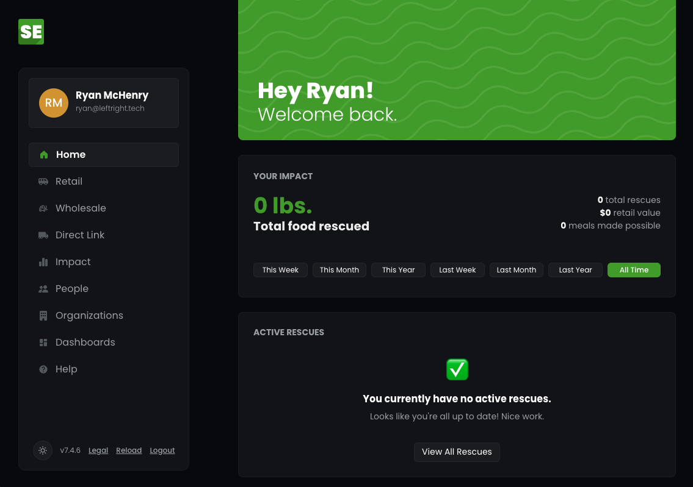  | 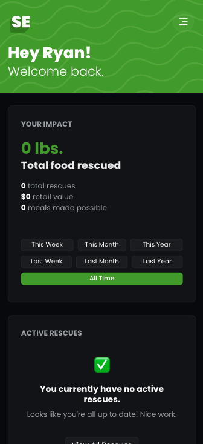

And hey, it's 2024! Of _course_ we support both dark and light modes :)

Desktop           |  Mobile
:-------------------------:|:-------------------------:
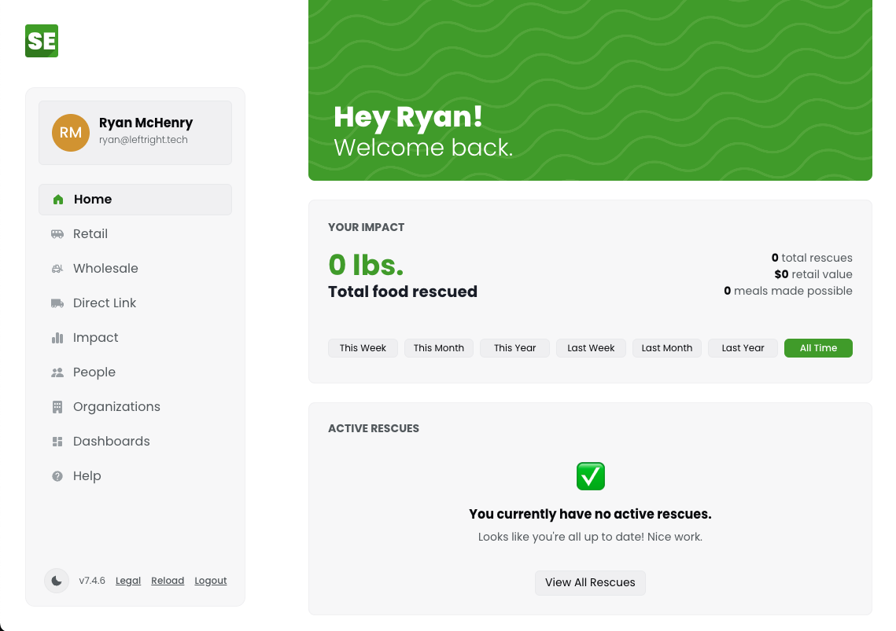  | 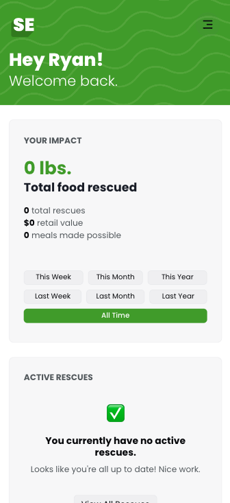

There are three primary views: Retail, Wholesale, and Direct Link. 

### 1. Retail

The Retail view contains all of our "retail" rescues, where a driver is routed from location to location to collect and distribute food.

Each retail rescue includes a list of transfers, each one a "collection" (picking up food from a donor organization) or a "distribution" (delivering food to a recipient organization). To complete a rescue, the driver will need to complete each transfer successively, and ensure that all food collected has been distributed.

The app provides a route overview powered by Google Maps. Within each individual transfer, a driver is provided wiuth instructions for the location, contact information for the partner organization, and a "map" button to get driving directions from their current location.

Rescue List            |  Active Rescue
:-------------------------:|:-------------------------:
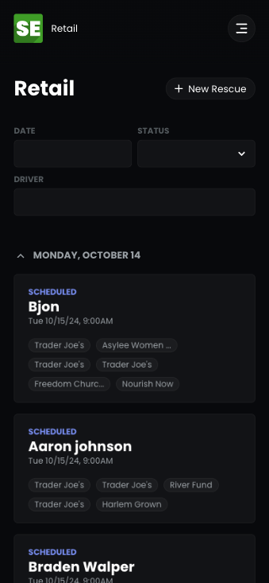  | 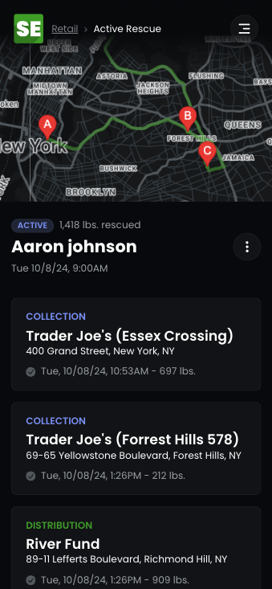

When a driver arrives for a "collection", they are able to log the food available by category (we use individual category values to most accurately estimate the retail value of a collection). We encourage drivers to add a row for each box to make their work easy and accurate (there can be many rows of the same category, and we'll sum them automatically).

Because recipients often pick and choose what food they can accept during a distribution, we keep the data entry as simple as possible, asking drivers to simply estimate the total weight (or percentage) delivered. The app will then estimate the weight for each food category based on the available load.

Completed times are automatically generated, but can be edited in case a driver needs to enter data later.

Collection           |  Distribution
:-------------------------:|:-------------------------:
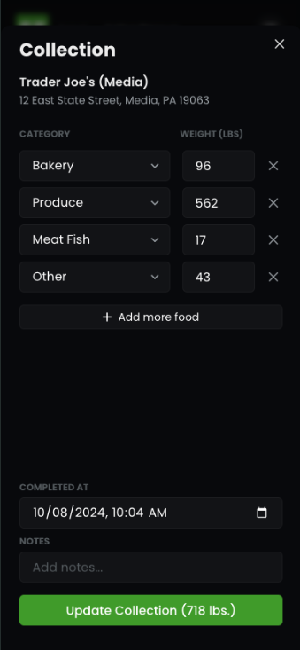  | 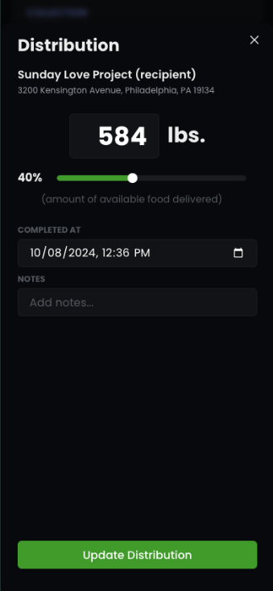

If all food has not been distributed once the last distribution is completed, the driver will be asked to "add another distribution" - they can always phone in HQ if they need assistance in knowing where to go.

### 2. Wholesale

The wholesale view manages all of our "wholesale" rescues. Each of these rescues is based on (and identified by) a single "collection" transfer, and a list of many "distribution" transfers to recipient organizations.

When creating a wholesale rescue, a manager will immediately enter data about the collection, and then later add recipients until all available food has been distributed.

Wholesale List           |  Wholesale Rescue
:-------------------------:|:-------------------------:
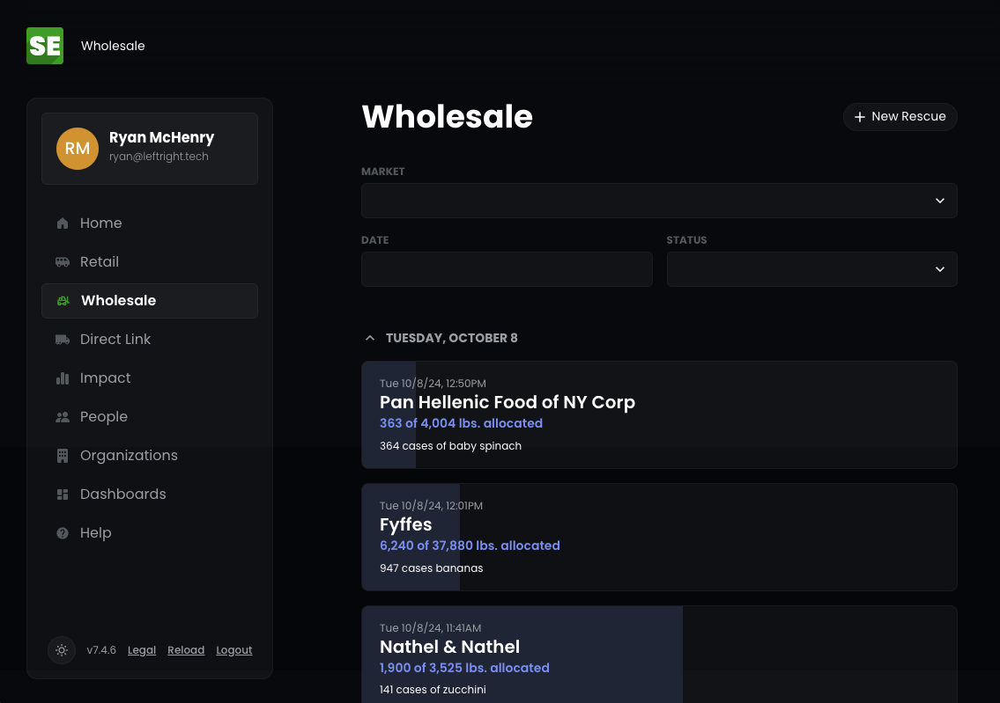  | 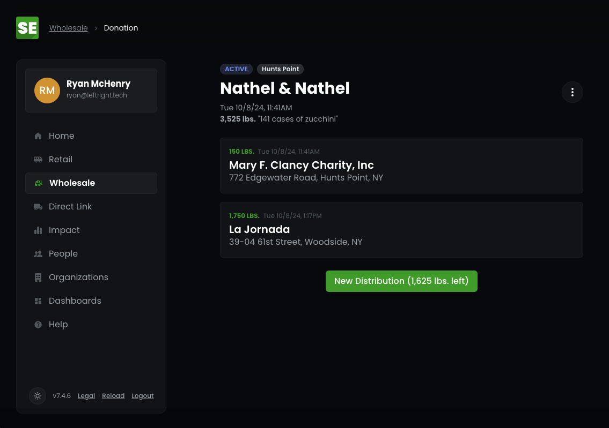

### 3. Direct Link

The Direct Link view manages all of our "direct link" rescues. These are rescues that we coordinate, but don't directly handle ourselves. They're most often comprised of a single collection and a single distribution (which represents us helping a donor find a place to send their surplus food), but it's possible to have more than one of each. They are always entered into the app after completion, and therefore are immediately in a "completed" state (no need for map directions or location-by-location data entry here).

Direct Link List          |  Log a Direct Link Rescue
:-------------------------:|:-------------------------:
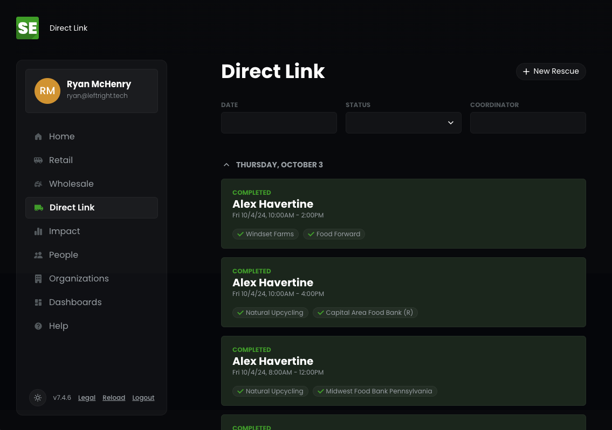 | 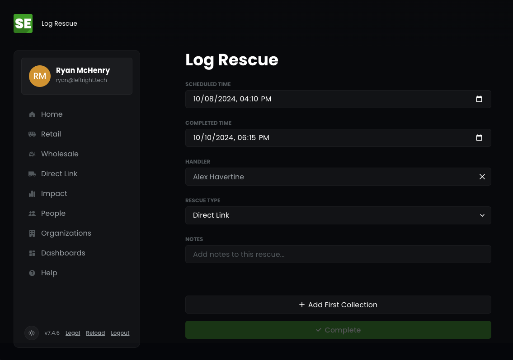

### People + Organization Management

We need to manage a library of both people and organizations for our rescue views to work as designed, and you guessed it, we have views for that too!

Notably, **only admins** will have the ability to view and manage users, organizations, and locations from the sidebar menu via the "People" and "Organizations" tabs.